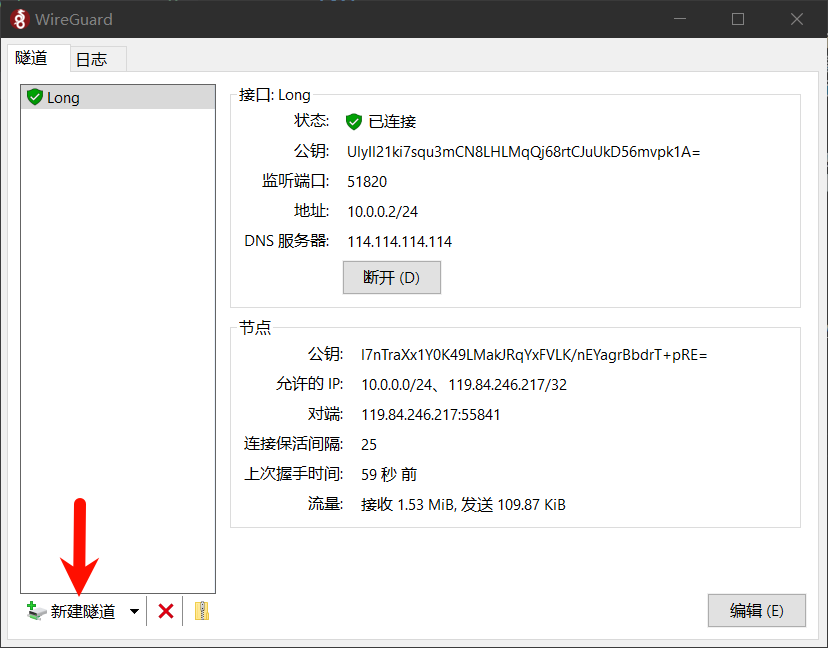
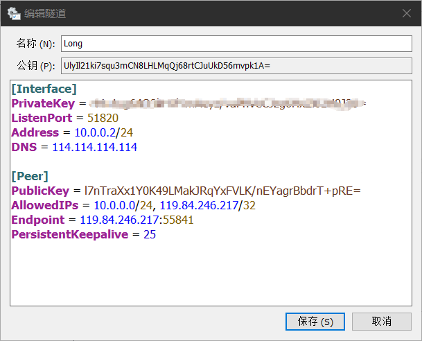

# 组建群友的虚拟子网以互相访问资源的指南

## 简介

我们可以通过Sakura FRP访问龙龙的服务器，但是隧道数有限。于是我将宝贵的另一个隧道用来映射服务器上的WireGuard监听端口。只要用户通过这一个隧道进行了WG的握手，龙服和用户就处于同一个虚拟子网从而可以访问所有网络资源。

另外，所有与龙服握手的PC之间也同属于一个子网，我们也能互相访问资源。只要用户与Sakura的服务器连接良好，应当能改善P2P游戏联机的延迟问题。

## 操作步骤

__安装 WireGuard__

[官方下载链接](https://download.wireguard.com/windows-client/wireguard-installer.exe)

__配置WireGuard__

新建隧道 -> 新建空隧道


会弹出一个文本编辑器


上方的名称可以随便写，建议写 `Long`

文本编辑器里的改写为

```ini
[Interface]
PrivateKey = YOUR_PRIVATE_KEY
ListenPort = 51820
Address = 10.0.0.x/24
DNS = 114.114.114.114

[Peer]
PublicKey = YOUR_PUBLIC_KEY
AllowedIPs = 10.0.0.0/24, 119.84.246.217/32
Endpoint = 119.84.246.217:55841
PersistentKeepalive = 25
```

- `PrivateKey` 是自动生成的，不要修改；
- `Address` 是你在虚拟子网中的地址，`x` 是 `0-255` 的任意整数，不要与其他用户相同；
- `PublicKey` 不要修改，发给老王

设置完毕后保存并连接，出现 __上次握手时间__ 时说明连接成功，可以通过
```CMD
ping 10.0.0.1
```
测试延迟